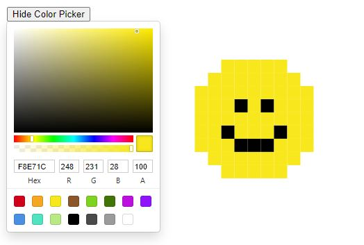

# r/place Clone Project

## Overview

This project is a clone of Reddit's r/place, where users collaboratively create and edit a canvas by placing pixels of different colors. The application will be able to support hundreds of concurrent users, managing high-frequency interactions efficiently.



## Features

- **Collaborative Canvas**: Users can place pixels on a shared canvas.
- **Real-Time Updates**: Changes made by one user are instantly visible to all other users.
- **Color Picker**: Users can choose any color to place on the canvas.
- **Zoom and Pan**: Users can zoom in and out of the canvas and pan across it.
- **Emoji and Character Support [TODO]**: Users can choose any emoji or text character to place on the canvas.

## Architecture

### Frontend

- **Technology**: React
- **Libraries**:
  - `create-react-app` for bootstrapping the project.
  - `redux` for state management.
  - `socket.io-client` for real-time communication.
  - `react-color` for color picker functionality.
  
### Backend

- **Technology**: Node.js with Express
- **Libraries**:
  - `express` as the web server framework.
  - `socket.io` for websocket communication.
  - `mongoose` to interact with MongoDB.
  - `dotenv` for managing environment variables.

### Database

- **Technology**: MongoDB
- **Structure**:
  - A `pixels` collection, with each document containing:
    - `x` (int): x-coordinate of the pixel.
    - `y` (int): y-coordinate of the pixel.
    - `color` (string): Hex code of the color.
    - `char` (string): Selected Emoji or text character.
    - `timestamp` (Date): Last update timestamp.

### Deployment: To Do

- **Platforms**:
  - Frontend: Netlify or Vercel.
  - Backend and Database: TBD.

## Detailed Components

### Frontend

#### Canvas Component

- Manages the interactive grid where users place pixels.
- Connects to the backend via WebSockets to receive and send pixel updates.

#### Color Picker Component

- Allows users to select a color from a predefined set or a custom color wheel.

### Backend

#### WebSocket Server

- Manages real-time communication with the frontend.
- Handles incoming pixel placement requests and broadcasts updates to all connected clients.

#### REST API

- `GET /pixels`: Retrieves the current state of the canvas.
- `POST /pixel`: Updates a pixel's color on the canvas.

### Database Operations

- Efficient read and write operations to handle frequent updates by multiple users.

## Scalability & Performance [TO DO]

### Caching

- Implement caching strategies for frequently accessed data, such as the current state of the entire canvas.

### Rate Limiting

- Prevent abuse and ensure fair usage by limiting the rate of pixel updates per user.

### Load Testing

- Prior to launch, perform load testing to ensure the system can handle the expected number of concurrent users.

## Security Considerations

### Input Validation

- Ensure that all inputs (e.g., pixel coordinates and colors) are validated both client-side and server-side.

### WebSockets Security

- Use secure WebSockets (`wss://`) to encrypt data transmission.

## Getting Started

### Prerequisites

- Node.js
- npm
- MongoDB

### Environment Variables

Create a `.env` file in the `rplace-server` directory and add the following:

```plaintext
MONGODB_URI=<your-mongodb-uri>
PORT=3001
```

### Installation

1. Clone the repository:
    ```bash
    git clone <repository-url>
    cd rplaceClone
    ```

2. Install frontend dependencies:
    ```bash
    cd rplace-client
    npm install
    ```

3. Install backend dependencies:
    ```bash
    cd ..
    npm install
    ```
3. Deploy frontend and backend:
    ```bash
    npm run dev
    ```
